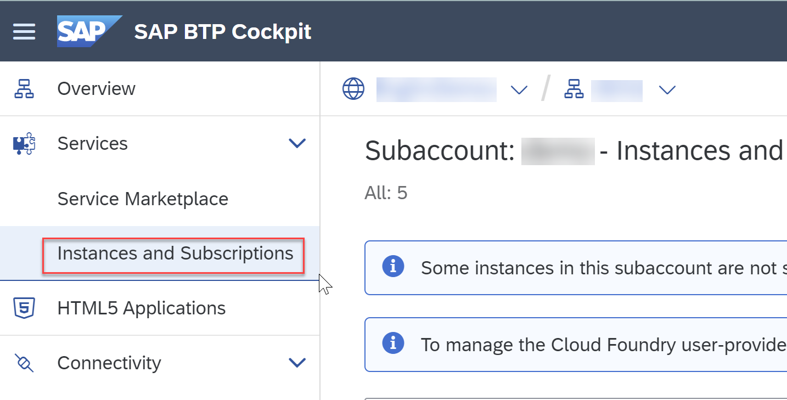
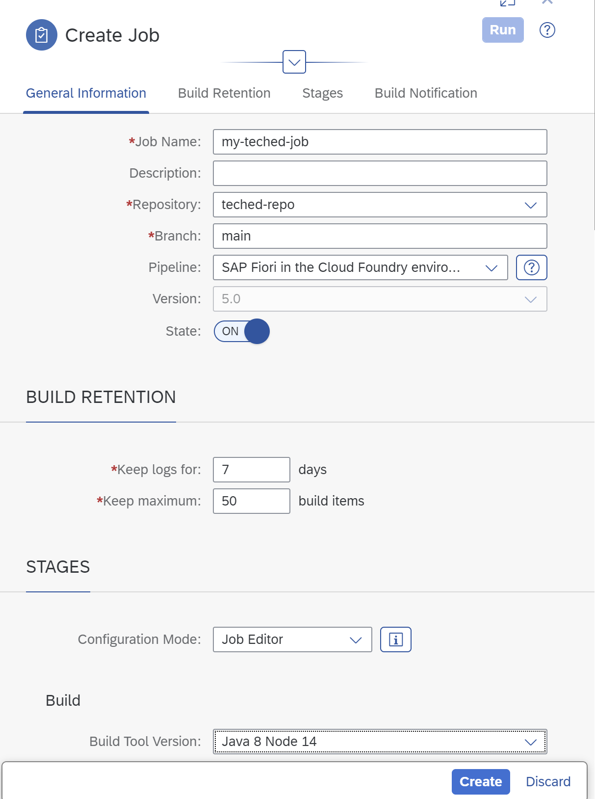

# Exercise 1 - Create a CICD Job

In this exercise, you will set up SAP Continuous Integration and Delivery and, in the service, create a job.

## Exercise 1.0 - Set Up SAP Continuous Integration and Delivery

### Subscribe to SAP Continuous Integration and Delivery

1. In your subaccount in the SAP BTP cockpit, choose **Services** → **Service Marketplace**.

2. In the text box, enter and search for `continuous`.

3. Click on the three dots **...** on the **Continuous Integration & Delivery** tile and choose **Create**.

    

 > **Note:** If you don't see the **Continuous Integration & Delivery** tile when you search for it, please skip to the next section for adding the correct entitlements first and then come back.

4. In the **New Instance or Subscription** pop-up, leave the default settings and choose **Create**.

### (Optional) Add the Correct Entitlements

If in the **Service Marketplace** in your subaccount, you didn't see the **Continuous Integration & Delivery** tile,
execute the following steps.

1. In your subaccount in the SAP BTP cockpit, choose **Entitlements**.

2. In the **Entitlements** overview of your subaccount, choose **Configure Entitlements**.

    

3. Choose **Add Service Plans**.

    

4. In the text box, enter and search for `continuous` and choose **Continuous Integration & Delivery**.

5. In the **Service Details: Continuous Integration & Delivery** pane, check the box next to **trial (Application)** and choose **Add 1 Service Plan**.

    

6. Back in the **Entitlements** overview of your subaccount, choose **Save**.

    

You can now go back to the previous section to subscribe to SAP Continuous Integration and
Delivery.

### Add the Required Permissions

1. In your subaccount in the SAP BTP cockpit, choose **Security** → **Users**.
 
2. Choose the arrow **>** next to your user entry.

    

3. In the **Role Collections** overview of your user entry, click on the three dots **...** and choose **Assign Role Collection**.

    

4. Check the boxes for **CICD Service Administrator** and **CICD Service Developer**, then choose **Assign Role Collection**.

    

### Open the Continuous Integration and Delivery Service

1. In your subaccount in the SAP BTP cockpit, choose **Services** → **Instances and Subscriptions**.

 

2. In the **Subscriptions** overview, choose **Continuous Integration & Delivery**.
Now, the user interface of SAP Continuous Integration and Delivery opens.

 

> **Note:** If you get an authorization error when trying to access the service, please log out of the SAP Business Technology Platform and log back in again.

## Exercise 1.1 Add Your Repository to SAP Continuous Integration and Delivery

Connect SAP Continuous Integration and Delivery with the repository in which your sources reside.

1. In SAP Continuous Integration and Delivery, choose **Repositories** → **+** _(Add)_.

 

2. In the **Add Repository** pop-up, add a name for your repository.

3. In GitHub, copy the HTTPS clone URL of the repository you just created in Exercise 0.

 

4. Paste it into the **Clone URL** field in the **Add Repository** pop-up in SAP Continuous Integration and Delivery without ".git" in the url suffix (for example: https://github.com/srinikitha09/teched2022-XP280).
5. Enter the **Name** for your repository and leave the rest of the fields as they are.
6. Choose **Add**.
 
 

## Exercise 1.2 (Optional) Create a Webhook

You can configure a webhook for your repository, which automatically triggers a build of your job when there is a change commit in the source code repository. 
1. In the **Repositories** tab in SAP Continuous Integration and Delivery, choose your newly created repository, then choose **Webhook Data**.
As a result, the Webhook Data pop-up opens. This pop-up provides the information you need to create a webhook in GitHub.

 

2. Copy both **Payload URL** and **Secret**, then click on the link to your GitHub repository.

 

3. In your project in GitHub, go to the **Settings** tab.

4. From the navigation pane, choose **Webhooks**, then choose **Add webhook**.
 
 

5. Enter the **Payload URL**, **Content type**, and **Secret** from the **Webhook Data** pop-up in SAP Continuous Integration and Delivery. For all other settings, leave the default values.

6. Choose **Add webhook**.

 

## Exercise 1.3 Create and Trigger a Job in SAP Continuous Integration and Delivery

1. In SAP Continuous Integration and Delivery, go to the **Jobs** tab and choose **+** _(Create job)_.

 

2. In the **General Information** section of the **Create Job** pane, enter the following values:
- **Job Name**: Freely choose a unique name for your job. We recommend using a name that contains both your GitHub project name and branch.
- **Repository**: From the drop-down list, choose your repository you have created.
- **Branch**: Enter `main`.
- **Pipeline**: From the drop-down list, choose **SAP Fiori in the Cloud Foundry environment**.

3. In the **Stages** section, choose **Job Editor** as **Configuration Mode**.

4. In the **Build** section, choose **Java 8 Node 14** as **Build Tool Version**.

 

5. Choose **Create**. You've now created your first CI/CD job, in which the **Build** stage is enabled.

6. To trigger a build of your job, choose **Run**.

 

## Summary

Congratulations! You've now set up SAP Continuous Integration and Delivery, added your GitHub repository to the service, and created and triggered your first CI/CD job.

Continue to - [Exercise 2 - Exercise 2 Description](../ex2/README.md)

