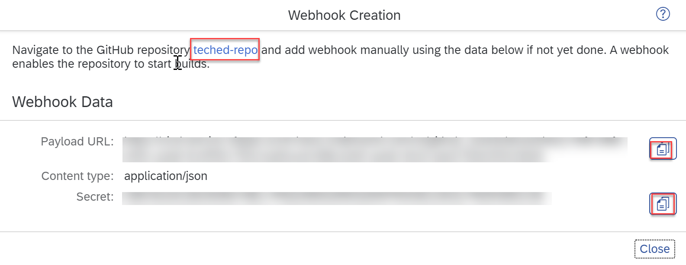

# Exercise 1 - Create a CICD Job

In this exercise, we will set up access to the Continuous Integration and Delivery service and create a job there.

## Exercise 1.0 - Set up SAP Continuous Integration and Delivery Service

### Subscribe to the SAP Continuous Integration and Delivery Service

1. Go to the **Service Marketplace** menu, seen on the left. Search for "continuous" and then click on
   the 3 dots above the SAP Continuous Integration and Delivery service. Click "Create".

    

 **NOTE**  > If you don't see the SAP Continuous Integration and Delivery service when you search for it, please add the correct entitlements by skipping to the next section and then come back.

1. Leave the default settings and click "Create".

 

### (Optional) Add Correct Entitlements

If you didn't see the SAP Continuous Integration and Delivery Service in the **Service Marketplace**,
follow these steps to make it available there.

1. Open the Entitlements menu, seen on the left. Click on the blue "Configure Entitlements"
   button.

    

1. That button should now say "Add Service Plans". Click that button.

1. Search for "continuous" and then click on the SAP Continuous Integration and Delivery service.
   Check the box next to "trial (Application)" and click "Add 1 Service Plan".

    

1. Back in the Entitlements menu, click "Save".

    

You can now go back to the previous section to subscribe to the SAP Continuous Integration and
Delivery service.

### Add Required Permissions

1. If you see a window pop up that says "Creation in Progress", you can close it.

1. Click on "Users", which is under the "Security" section on the left side menu. Then click on the
   arrow on the far right side of your user entry.

    

1. After scrolling to the bottom of the new menu that opened, click on the 3 dots, and then click
   on "Assign Role Collection".

    

1. Check the boxes for "CICD Service Administrator" and "CICD Service Developer". Click "Assign Role
   Collection".

    

### Open the service

You should now be able to access the SAP Continuous Integration and Delivery service.

You can do so by going back to the "Instances and Subscriptions" section, seen in the left menu bar.

 

Then, click on "Continuous Integration & Delivery". After clicking on it, you will be navigated to
the User Interface of the SAP Continuous Integration and Delivery service.

 

> If you get an authorization error when you try to access the service, please log out of the SAP Business Technology Platform and log back in again.

After successfully opening the SAP Continuous Integration and Delivery service, please follow below
steps to configure a job.

## Exercise 1.1 Create a Repository

Before configuring a job, it is a prerequisite to create a repository where the source code of your application resides.

In the CI/CD UI, create a repository by clicking on **Repositories** list as shown in the below image.

 

Then, configure the repository by entering the necessary fields. In the **clone URL** field, enter the url of your forked github repository as shown in the below image.
 
 

## Exercise 1.2 Create a Webhook

It is optional to the users to configure the webhook for their repository. Configuring webhook enables triggering the build automatically when there is a change commit in the source code repository. 
To configure a webhook, go to the repository you have just created, and click on **Webhook Data** button as shown in the below image.

 

After that, copy **Payload URL**, **Secret** and click on your repository link as shown in the below image.

 

Then, click on **Add Webhook** button on top right side of the page as shown below.
 
 

In the webhook settings, paste the **payload URL** and the **Secret**, select **Just the push event** radio button and then click on **Add Webhook** button.
So now, you have configured the webhook for your job.

 

## Exercise 1.3 Create a Job

After successfully creating a repository and webhook, we are now ready to create a job in CICD service.
Click on **Jobs** list and then click on **+** button to create a job.

 

 Please enter the mandatory fields as shown in the following image. 
 - Choose the repository that you have just created from the drop down list. 
 - Select the **Branch** as "main". Select **Pipeline** "SAP Fiori in the Cloud Foundry environment". 
 - From the **Stages** section, select **Configuration mode** as "Job Editor".
 - From the **Build** section, choose **Build Tool Version** as "Java 8 Node 14" 

 

Finally, click on the **Create** button. You've now created a first job in CICD service with **Build** stage enabled.

## Exercise 1.4 Trigger the Build

To trigger the build, click on **Run** button as shown in the image.

 

## Summary

Cheers! you've now created a first job via CICD pipeline and triggered the first build.

Continue to - [Exercise 2 - Exercise 2 Description](../ex2/README.md)

