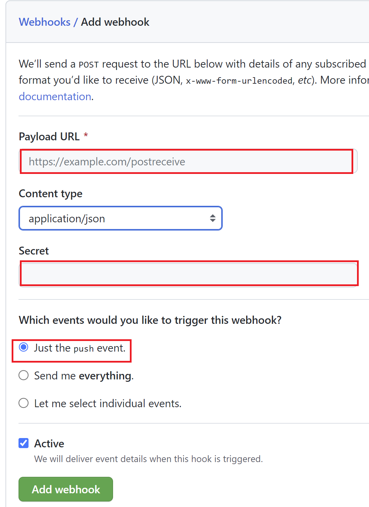

# Exercise 1 - Create a CICD Job

In this exercise, we will create a cicd job.
To configure a job via CI/CD service, please log in to SAP Continuous Delivery and Services.
To login to it, go to the subaccount in the SAP BTP cockpit wherein you have subscribed to this instance.Then, click on **Instances and Subscriptions** button from left side menu as shown in the following image. Then, click on **Continuous Integration and Delivery**. After clicking on it, you will be navigated to the login page of the service. Please enter the username and password.

 

!!! note "Authorization Error"
If you get an authorization error when you try in a later exercise to access the service, please log out of the SAP Business Technology Platform and log back in again. After that you shouldn't have any problems with accessing the service.

After a successful login into CI/CD service,please follow below steps to configure a job.

## Exercise 1.1 Create a Repository

Before configuring a job, it is a prerequisite to create a repository where the source code of your application resides.

In the CI/CD UI, create a repository by clicking on **Repositories** list as shown the below image.

 

Then, configure the repository by entering the necessary fields.
 
 

## Exercise 1.2 Create a Webhook

It is optional to the users to configure the webhook for their repository. Configuring webhook enables triggering the build automatically when there is a change commit in the source code repository. 
To configure a webhook, go to the repository you have just created, and click on **Webhook Data** button as shown in the below image.

 

After that, copy **Payload URL**, **Secret** and click on your repository link as shown in the below image.

 

Then, click on **Add Webhook** button on top right side of the page as shown below.
 
 

In the webhook settings, paste the **payload URL** and the **Secret**, select **Just the push event** radio button and then click on **Add Webhook** button.
So now, you have configured the webhook for your job.

 

## Exercise 1.3 Create a Job

After successfully creating a repository and webhook, we are now ready to create a job in CICD service.
Click on **Jobs** list and then click on **+** button to create a job.

 
 Please enter the mandatory fields as shown in the following image. 
 - Choose the repository that you have just created from the drop down list. 
 - Select the **Branch** as "main". Select **Pipeline** "SAP Fiori in the Cloud Foundry environment". 
 - From the **Stages** section, select **Configuration mode** as "Job Editor".
 - From the **Build** section, choose **Build Tool Version** "Java 8 Node 14" 

 

Finally, click on the **Create** button.

You've now created a first job in CICD service with build stage enabled. By default, build stage is always on.
Now, you can run the first build by clicking on the **Run** button as shown in the image.

 

## Summary

Cheers!You've now created a first job via CICD pipeline and triggered the first build.

Continue to - [Exercise 2 - Exercise 2 Description](../ex2/README.md)

